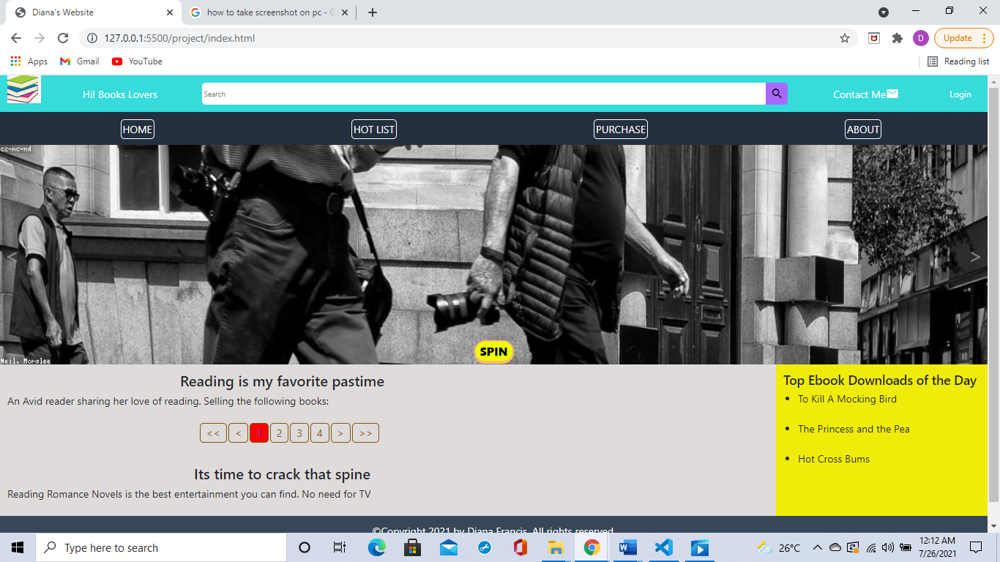

# https://dianadfrancis.github.io/website/
## This is my first personal website.
### The website structure:
- Home
- Hit List
- Purchase
- About
- Contact Me


<p align="center">
  
</p>

### Git commands I used:
```
git clone https://github.com/username/repository-name
git add .
git commit -m "description"
git push
```
